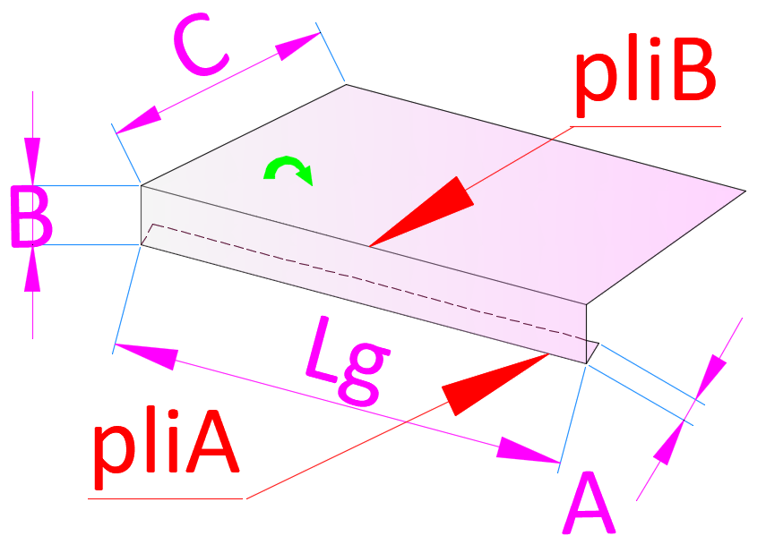

# `assets/pieces/` — Catalogue d'images de pièces

> **Status : currently UNUSED in production.**
>
> Reserved for **future visual previews** of aluminum pieces:
> configurateur (vignette d'aperçu de la pièce sélectionnée), devis
> (illustration des lignes), fiche pièce détaillée, etc.

## Historique

Ces 197 PNG ont été extraits du zip d'origine `calculette-main` en phase 2
du refactor (commit `f13005a`, 2026-05-04). Leur unique consommateur de
l'époque, `nouvelle-page.html` + `plialu-data.js`, a été supprimé dans
le même refactor (Q1 — option A : suppression directe). Les images
elles-mêmes ont été **conservées** car elles représentent le catalogue
visuel des articles du métier (bavettes, couvertines, cornières, etc.)
— une donnée métier réutilisable.

Lors de l'extraction, les noms de fichiers ont été **dé-mojibakés**
(`#U00e9` → `é`, `#U00e0` → `à`). Les espaces et la casse d'origine
sont conservés.

## Comment les consommer (depuis un futur module)

Le dossier vit à la racine du dépôt sous `assets/pieces/`. Profondeurs
relatives :

| Depuis | Chemin |
|---|---|
| `index.html` (hub, racine) | `assets/pieces/<file>.PNG` |
| `modules/<nom>/<page>.html` | `../../assets/pieces/<file>.PNG` |

Exemple — affichage d'une vignette :

```html

```

## Convention de nommage proposée pour les nouveaux fichiers

Les 197 fichiers existants utilisent les noms d'origine (humains, avec
espaces et accents). Pour les futurs ajouts, deux options :

1. **Conserver le format humain** (cohérent avec l'existant) :
   `Capture Bavette 2 Plis Generique.PNG`
2. **Adopter un slug** (plus robuste pour l'URL et le shell) :
   `bv2plis_90deg.png` — `articleName.toLowerCase().replace(/\s+/g, '_').replace(/[^a-z0-9_\-]/g, '')`

Le futur consommateur tranchera selon ses besoins (mapping
article → URL d'image), idéalement via une table de correspondance
explicite (genre `plialu-pieces.js` exposant `{ articleId: imagePath }`).

## Nombre de fichiers

197 PNG (≈ 17 Mo). Liste exhaustive disponible via `ls assets/pieces/`.
